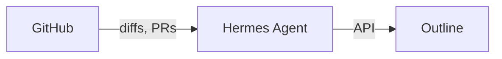

# Engineering Journal Writer

A [Hermes Agent](https://github.com/nousresearch/hermes-agent) skill that generates staff-engineer-quality technical journal entries from your commits and publishes them to [Outline](https://www.getoutline.com/).

You give it commit hashes, a repo name, and optionally some context about what you were debugging. It reads the diffs and PR info from GitHub, then writes a deep investigative journal entry — the kind you'd write if you had the time and energy after a long debugging session.

## Requirements

- Hermes Agent runtime
- Python 3 (see `.python-version`)
- [uv](https://docs.astral.sh/uv/) for running scripts and tests
- `GITHUB_TOKEN` environment variable (see [Token Scopes](#github-token-scopes))
- `OUTLINE_API_TOKEN` environment variable
- [Outline](https://www.getoutline.com/) instance (cloud or self-hosted)

## How It Works

Give the agent commit hashes and a repo name. The skill will:

1. **Fetch** commit diffs, messages, and associated PR info (cached to avoid re-fetching)
2. **Write** a deep technical journal entry following the symptom → investigation → root cause → fix → lesson structure
3. **Publish** the entry to your Outline engineering journal collection (updates existing entries with the same title)

If any required config is missing, the agent will reply with the exact commands to set them up.

### Architecture



## Config

| Key | Description | Default |
|-----|-------------|---------|
| `engineering_journal.outline_url` | Outline base URL | *(required)* |
| `engineering_journal.outline_collection_id` | Collection ID for journal entries | *(required)* |
| `delegation.model` | Model for the journal writing sub-agent (global) | `deepseek/deepseek-v4-pro` |
| `delegation.provider` | Provider for the delegation model (global) | `openrouter` |
| `OUTLINE_API_TOKEN` | Outline API token (in `~/.hermes/.env`) | *(required)* |
| `GITHUB_TOKEN` | GitHub token (in `~/.hermes/.env`) | *(required)* |

### GitHub Token Scopes

The `GITHUB_TOKEN` requires **minimum** scopes:

| Scope | Why |
|-------|-----|
| `contents:read` | Read commit diffs and file contents |
| `pull_requests:read` | Fetch associated PR titles and descriptions |

For **fine-grained personal access tokens** (recommended), select only the repositories you need and grant `Contents → Read-only` and `Pull requests → Read-only`.

For **classic tokens**, the `repo` scope covers both but grants broader access than necessary.

## Running Tests

```bash
uv run python -m unittest discover -s tests -v
```

## Project Structure

```
├── SKILL.md                       # Agent directive — journal workflow and writing prompt
├── scripts/
│   ├── __init__.py
│   ├── journal_helper.py          # CLI entry point (fetch, publish)
│   ├── http_client.py             # Shared HTTP client with retry and error handling
│   ├── github_client.py           # GitHub API client (commits, diffs, PRs)
│   └── outline_client.py          # Outline API client (create/update documents)
├── tests/
│   ├── __init__.py
│   ├── test_http_client.py        # HTTP client tests (retries, error classification)
│   ├── test_github_client.py      # GitHub client tests (fetch, token resolution)
│   └── test_outline_client.py     # Outline client tests (publish, dry-run, idempotency)
├── pyproject.toml                 # Project metadata
├── .python-version                # Python version pin
└── README.md
```

## Error Handling

The tool retries automatically on transient failures (502, 503, 429, network errors) with backoff. It also handles GitHub's secondary rate limits (403 + `Retry-After`) and proactively pauses when `X-RateLimit-Remaining` is nearly exhausted.

If a request still fails after retries, the agent responds with a clear, actionable message:

- **401** — Authentication failed (bad or expired token)
- **403** — Insufficient permissions or rate limit exceeded
- **404** — Repository or commit not found
- **422** — Validation error (malformed request)
- **Network errors** — Retried, then surfaced with details

See the Error Handling section in `SKILL.md` for the full agent behavior mapping.

## Sample Output

Published to Outline as:

> **Fixing Certificate Pinning Mismatch for www.idn.app in Android WebView**
>
> > **Date:** 2026-04-28  **Project:** AcmeApp  **Tags:** android, webview, ssl, certificate-pinning
>
> Our beta testers reported a blank WebView on the quest screen. Debug builds worked fine. Release builds showed nothing — no error, no crash, just white...
>
> ## Context
> Our app uses certificate pinning via `network_security_config.xml` to prevent MITM attacks...
>
> *(continues with full investigation, code blocks from the diff, root cause analysis, and takeaway)*

## Tags

`Android` `Engineering-Journal` `GitHub` `Outline` `Documentation`

## License

[MIT](LICENSE.md)
